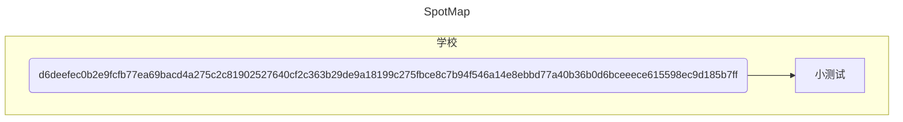

# 自在、独行
## 初期探险

下午3点，刚从3C3U"下机"的我开始了我下午的探险，目的是与各种平凡的角落拍出不平凡的照片。

一出门，一排花坛便映入了我的眼帘，我忽地想起早在半个月前我便想拍一张了。于是，迎着温柔的阳光，我找了个我认为很行的角度，拍了张照片。

:::details 图片内容

	
:::

之后我便朝2db8848eac0e558fe17941b47b653b4d563de3e9d4373b1e7ebcfd4460c99e72走去，从桃子湖的路不断深入，踏足我之前并未到达的地方，我继续前进，路过一个地板黄黄的羽毛球场，上面有个老人扭着头闭着眼，沐浴在下午的阳光中。我静静地走过。

走出湖师大的科技院区后，我右转拐入了一片落叶满地，树木“高耸入云”的小道，阳光斜下来，被层层略显光秃的树枝遮挡，只有它的中心仍那般刺眼，在我的相机中留下了一条拖长的轨迹。

我于是走着，绕了一大圈后回到了3827209af1423fa50f3317d1c07741733c625ea86086924ed62873289e65f4f5。接下来便是我的旅程：

1.位于5c9e7faf4606fc64c1868eead7d273cf3b21790d285ba35025345e1dcaa822ba49b521880c5e24a28c8177324578045c拍的。阳光从树中透过，我试着用三分法拍了下来。进度:2%

:::details 图片内容

:::

2.树林后的太阳与远处的山。进度:15%

:::details 图片内容

:::

3.湖南大学的网球场（左边有一堆网球hhh）。进度:25%（没有拍）

:::details 图片内容

:::

4.湖南大学某院（有天马村）的食堂天桥的穹顶。（很干净的一张图）进度:30%

:::details 图片内容

:::

5.下午，阳光把整栋房子映得米黄进度:45%

:::details 图片内容

:::

到了桃子湖，我也准备回学校了。

:::details 路线详情

:::

于是，桃子湖给了我

一个

巨大的惊喜

## 
Claude Monet

说实话我以前就被莫奈的作品给震撼过，虽然当时我并没有感受到美术书上所讲的能感受到光的刺眼，但我认为他还是将现实画得挺传神的，尤其是阳光下的女人衣服上的光班。但，很多时候我更喜欢的是超现实或者蒙太奇类的作品。在我的理解中，超现实、达达主义、蒙杰奇等手法或思想其实是对现实的一种独特的解构。换句话来讲面对这些作品，你甚至不需要去想，只需看即可，因为那
种不属于真实世界的新奇感会一直句起你的兴趣，进而让你觉得这幅色很有意思。于是莫奈便被我逐渐忘记了。

直到上个星期，我从“小透明明TV”那儿刷到了莫奈、听了他们的解读。于是,接下来的很长一段时间我脑子里面想的都是莫奈的那受些色彩斓的画。尤其是他的《日出·印象》。

新年，桃子湖让我看到了他的世界，看到了《日落·印象》。

刚走上桃子湖边上的小路，我便被那遍地的黄色柳树叶给迷住了，此时的小路，仿佛动漫一般，不真实。随后，我往前走了走，看到了橙红的太阳泛着黄光，倒映在青绿色的水面上。桃子湖的水平静，可其上飘浮的植物梗叶却如同一个个涟漪，让湖面有了黑色，灰绿色，褐色......各种颜色错落有致地铺在湖面上，远处又是那在雾中若隐若现的山和雨。这一切，真的如同莫素的画!

我找了好几个不同的角度，拍了好几张。之后，我恋想不舍地离开桃子湖，朝1ddf436474216954b44a284ad3375d7ba5b8b9209aa1ff05ca8d6ce3fa882660走去，落日逐人归。

以下，便是我对桃子湖那时色的绘图尝试，希望我能画出1%的美丽

进度：100%

:::details 铺满柳叶的路

:::

:::details  日落-我的印象

PS：纵使我使出浑身解数还是不能将那张美图绘制出其1%的美。

:::

两张图我都花了好长的时间来绘制，加起来我一共花了4小时左右。啧啧，比我描画（Forget Me Not Vol.I中的那张）。不过还好我将美保存了下来。

## 
后记

实际上我也只独行了2个多小时，但为什么我搞了4面搞得好像我过了4天呢？因为这是新年发生的事，以后便没有这么多的耐心了hhh!

Cheers! 2025/1/2 

PS：不过我记得去年大约这个时间我也画了幅画，今年就算是一种传承吧！

:::details 点开查看SpotMap

:::

